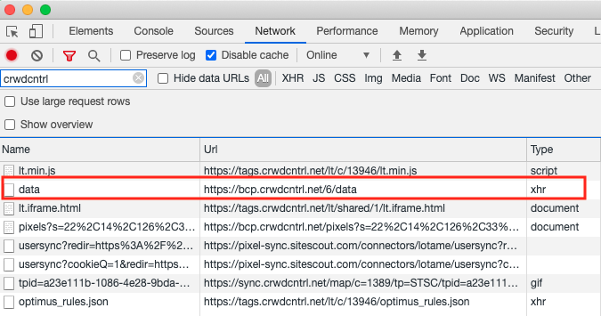
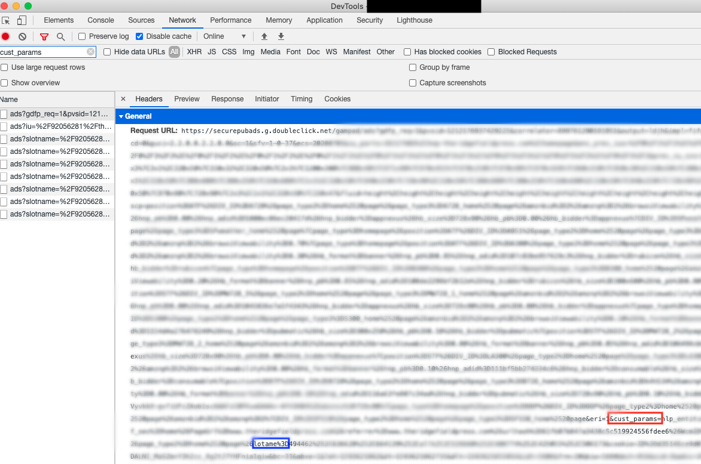

# Post-Implementation Validation

After Lightning Tag has been implemented, how do I confirm it was implemented correctly?

## Lightning Tag Validations

Open your browsers DevTools and load/refresh the page that you want to test.

### Validate 1st Impression Call

In DevTools, Switch to the Network tab and type `crwdcntrl`  in the filter field to show calls on your page to the Lotame Lightning Tag. Look for `bcp.crwdcntrl.net/6/data`

Select that row and then look at the response tab. The Response should look something like:

`{"pid":"7de1b12b97e8ef15f61ccfcbe59368ca","tc":["target_code1","target_code2","all"],"spx":[61,14,81,8,5,115]}`

Whereas the `pid` is the Lotame profile ID and the `tc` containsTargeting Codes (or Audience IDs)

!> If this is blank, then either you may not have correctly implemented the Profile Extraction callback. Please review the `onProfileReady` and `audienceLocalStorage` parts of the `config` object of [Lightning Tag's documentation](lightning-tag/detailed-reference?id=config-object). If you have reviewed that and still need assistance, please reach out to Lotame by emailing support@lotame.com.

### Validate Profile ID Storage

If in a 3rd party environment - Using the cc_id parameter, the Lotame pid should be set under:
crwdcntrl.net cookie
client domain’s cookie (ex. mysite.com)
client domain’s localStorage (ex. mysite.com)
If in a 1st party environment - Using the cc_id parameter, the Lotame pid should be set under:
client domain’s cookie (ex. mysite.com)
client domain’s localStorage (ex. mysite.com)
Tip
Google - Open Web Inspector → Click on the ‘Application’ tab
FireFox - Open Web Inspector → Click on the ‘Storage Tab’

## Integrating with Google Ad Manager

1. Make sure that the url of the call to Google Ads Manager (DFP) is less than 15,360 characters per [Google's Ad Manager Reference](https://support.google.com/admanager/answer/1628457?hl=en)

1. Check that the `pubads` call contains the Lotame audiences. Do this by searching in the network for `cust_params` parameter.

`https://securepubads.g.doubleclick.net/gampad/ads?gdfp_req=1&pvsid=712006463767097&.........lotame=all,asvisit`

!> If they are not there, and you have validated above that Lightning Tag is successfully returning them, then please confirm that you are passing those values into the Google call successfully within your Google Ads implementation. An example can be found on our [Google Ad Manager Guide](lightning-tag/implementation-google-ad-manager).

## GTM (Google Tag Manager) Implementation

Although Lotame advises your team to implement Lightning Tag directly in the `<head>` parameter of the page for best performance, Lightning Tag can be deployed through Google Tag Manager. For best performance, prioritize the call to pull in Lightning Tag as high up on the page as possible within GTM.
